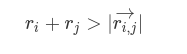
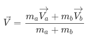
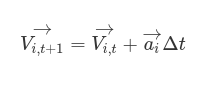
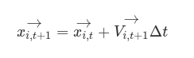

# Parallel N-Body Simulation

## Table of Contents

1. Problem Description
2. User Guide

   * Clone Repository
   * Program Arguments
   * Build and Run
   * Example
3. Results Analysis

# Problem Description

This project implements a simulation of an arbitrary number (**N**) of bodies moving in three-dimensional space.

The simulation models a physical phenomenon such as gravitational attraction or electromagnetism. For this project, **gravitational attraction based on classical physics models** is used.

The program reads a job file containing one or more simulation configurations, each associated with:

* A universe file.
* A simulation time step (`delta_t`).
* A maximum simulation time.

Example job file:

```text
univ001.tsv 60 180
univ002.tsv 1 10
univ001.tsv 30 260
```

Each line specifies:

1. The universe file containing the bodies to simulate.
2. The simulation time step.
3. The maximum simulation duration.

## Universe Files

A universe file contains the bodies that belong to a simulation.

Example:

```text
2500    5   0    0    0    0    0    0
60      1   15   5    0    0    0    0
10000   20  12  -30   0  -40    0    0
```

Each row represents a body and contains:

```text
Mass  Radius  Position(x,y,z)  Velocity(x,y,z)
```

Where:

* **Mass** represents the total mass of the body.
* **Radius** represents the body's radius.
* **Position** is given by its x, y, and z coordinates.
* **Velocity** is given by its x, y, and z components.

The simulation computes the interactions between all bodies contained in the universe.

## Simulation Process

For every simulation step, the following operations are performed:

### 1. Collision Detection

If the collision condition is satisfied:



the collision formula is applied to the colliding bodies:



### 2. Velocity Update

Body velocities are updated using the following equation:



### 3. Position Update

Body positions are updated using the following equation:



These three stages are repeated until one of the following stopping conditions is reached:

1. The maximum simulation time is reached.
2. All bodies have merged into a single body.

## Output Files

When a simulation finishes, the results are written to a file using the following naming convention:

```text
univNNN-TTT.bin
```

or

```text
univNNN-TTT.tsv
```

depending on the input file extension.

Where:

* **NNN** is the simulation identifier.
* **TTT** is the simulated time reached before termination.

## Additional Documentation

For a detailed discussion of the solution design and implementation, see:

```text
design/README.md
```

The original problem statement can be found on Professor Jeisson Hidalgo Céspedes' website:

https://jeisson.ecci.ucr.ac.cr/concurrente/2024b/proyectos/nbody/

# User Guide

## Clone Repository

Open a terminal and navigate to the directory where you want to clone the project.

```bash
git clone https://git.ucr.ac.cr/paralela24b-nombre_equipo/proyecto01.git
```

Then navigate to the project directory.

```bash
cd proyecto02
```

## Program Arguments

The program accepts the following arguments:

### Required

* Path to a job file.

Example:

```text
test/job001/job001.tsv
```

### Optional

* Number of threads used during execution.

If this argument is omitted, the program automatically uses the number of CPU cores available on the machine.

## Build and Run

### Build

Compile the project using:

```bash
make clean && make
```

### Execute

The program can be executed in two different modes:

#### Serial / Multithreaded Version

For serial execution, specify a thread count of `1`.

```bash
bin/proyecto02 path/to/job.tsv number_of_threads
```

Example:

```bash
bin/proyecto02 test/job001/job001.tsv 4
```

#### Distributed Version (MPI)

```bash
mpiexec -np number_of_processes bin/proyecto02 path/to/job.tsv number_of_threads
```

Example:

```bash
mpiexec -np 3 bin/proyecto02 test/job001/job001.tsv 4
```

# Results Analysis

A detailed performance comparison between the serial, multithreaded, and distributed implementations can be found in:

```text
report/README.md
```

The report includes execution time measurements, scalability analysis, and performance comparisons across different execution configurations.
