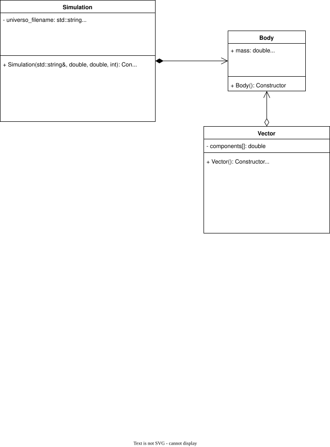
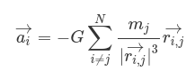

# Design Document

This document describes the architecture, design decisions, and implementation strategy used for the **Parallel N-Body Simulation** project.

The objective of the project is to simulate the gravitational interaction of an arbitrary number of bodies in three-dimensional space while exploring different execution models, including serial, shared-memory parallelism, and distributed computing.

# System Design

## UML Diagram

The following UML diagram presents the main classes and relationships used throughout the project.



# Design Overview

The implementation was developed incrementally in three stages.

## Phase 1: Serial Implementation

The first objective was to build a correct serial version of the simulator before introducing any parallelization.

### Test Case Development

The project began by creating validation scenarios based on the examples discussed during the course.

These test cases provided a reliable way to verify the correctness of the simulation throughout the development process.

### Job File Processing

The simulator reads a job file containing:

* Universe files.
* Simulation time steps (`delta_t`).
* Maximum simulation times.

Each entry defines an independent simulation that must be executed.

### Physics Model Analysis

Before implementation, the physical formulas governing the simulation were studied and analyzed to ensure a correct understanding of the problem domain.

This phase focused on:

* Gravitational interactions.
* Collision handling.
* Velocity updates.
* Position updates.

### Universe Loading

Each universe file is parsed to load all bodies participating in the simulation.

Each body contains:

* Mass
* Radius
* Position vector
* Velocity vector

### Simulation Loop

The simulation continues until one of the following stopping conditions is reached:

* Only one body remains after successive collisions and mergers.
* The maximum simulation time is reached.

During each iteration, the following operations are performed:

1. Velocity update.
2. Position update.
3. Collision detection.
4. Time update.
5. Termination condition evaluation.

### Position Vector Calculation

The position vector between bodies is calculated using:



### Velocity Update

Body velocities are updated according to:


### Position Update

Body positions are updated using:


### Collision Detection

A collision occurs when the following condition is satisfied:


When a collision is detected, the colliding bodies are merged using:


### Simulation Finalization

At the end of every simulation step:

* Time is updated.
* Body masses are updated when collisions occur.
* Stopping conditions are evaluated.

Once a stopping condition is satisfied, the resulting universe is written to the output file.

## Phase 2: OpenMP + MPI Implementation

After validating the serial version, the simulator was extended to support hybrid parallel and distributed execution.

The implementation combines:

* OpenMP for shared-memory parallelism.
* MPI for distributed execution across multiple processes.

### MPI Work Distribution

The main process is responsible for distributing simulation jobs among available MPI processes.

Each process receives:

* Universe filename.
* Simulation time step.
* Maximum simulation time.
* Universe metadata.

Once the data is received, the process executes the assigned simulation independently.

### OpenMP Parallelization

The most computationally expensive portions of the simulation were parallelized using OpenMP.

#### Velocity Updates

Velocity calculations were parallelized by distributing bodies among worker threads.

Each thread computes:

* Position vectors.
* Gravitational forces.
* Velocity updates.

independently for its assigned bodies.

#### Position Updates

Position calculations were also parallelized using OpenMP.

Each thread updates the positions of its assigned bodies concurrently.

### Remaining Simulation Logic

The following operations remain logically identical to the serial implementation:

* Collision detection.
* Body merging.
* Output generation.
* Simulation termination checks.

The difference lies in the parallel execution of the computational workload.

## Phase 3: Performance Evaluation

After implementing the hybrid solution, the different versions were evaluated and compared.

The experiments were executed on the course computing cluster.

The evaluation focused on:

* Total execution time.
* Speedup.
* Efficiency.
* Scalability.

Results and performance analysis are available in:

```text
report/README.md
```

# Parallelization Strategy

The simulator follows a hybrid execution model.

## Shared-Memory Parallelism

OpenMP is used to parallelize computational loops inside each process.

Benefits include:

* Reduced execution time.
* Efficient CPU utilization.
* Low communication overhead.

## Distributed Parallelism

MPI is used to distribute independent simulation jobs across multiple processes.

Benefits include:

* Scalability across multiple nodes.
* Larger computational capacity.
* Improved overall throughput.

# Design Goals

The project was designed with the following objectives:

* Correct implementation of gravitational N-body simulation.
* Support for multiple universe configurations.
* Efficient handling of large simulations.
* Scalability through parallel and distributed computing.
* Clear separation between simulation logic and execution model.
