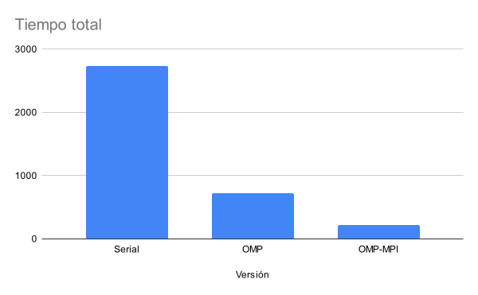
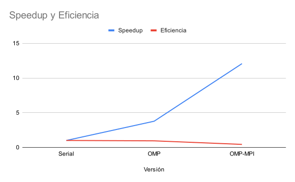

# Performance Analysis

This document presents the performance evaluation of the different implementations developed for the N-Body Simulation project.

The objective of the analysis is to compare the execution time, speedup, and efficiency achieved by the following versions:

* Serial
* OpenMP (Shared-Memory Parallelism)
* OpenMP + MPI (Hybrid Parallel and Distributed Execution)

# Performance Comparison

## Execution Time

The following figure compares the total execution time achieved by each implementation.

## Speedup and Efficiency

The following figure illustrates the speedup and efficiency obtained relative to the serial implementation.

# Results Summary

| Implementation | Execution Time (s) | Speedup | Efficiency |
| -------------- | -----------------: | ------: | ---------: |
| Serial         |        2729.628978 |    1.00 |       1.00 |
| OpenMP         |         723.434824 |    3.77 |       0.94 |
| OpenMP + MPI   |         226.143653 |   12.07 |       0.43 |

# Discussion

The experimental results demonstrate substantial performance improvements for both parallel implementations when compared to the serial baseline.

## OpenMP Implementation

The OpenMP version achieved a speedup of approximately **3.77×** while maintaining an efficiency of approximately **0.94**.

These results are consistent with the hardware used during testing, which consisted of a four-core processor available through the OpenHPC cluster.

The near-linear speedup and high efficiency indicate that the workload was effectively parallelized and that the available processing resources were utilized efficiently. The execution time was reduced to nearly one-fourth of the original serial execution time, demonstrating excellent scalability within a shared-memory environment.

## OpenMP + MPI Implementation

The hybrid OpenMP + MPI implementation achieved the best overall performance, reducing the execution time to approximately **226 seconds** and reaching a speedup of approximately **12.07×** compared to the serial version.

This significant improvement demonstrates the benefits of combining:

* Shared-memory parallelism through OpenMP.
* Distributed-memory parallelism through MPI.

However, the achieved efficiency decreased to approximately **0.43**.

This reduction is expected because distributed execution introduces additional overheads, including:

* Inter-process communication.
* Network latency.
* Message passing synchronization.
* Load balancing between processes.

Although these overheads reduce overall efficiency, the hybrid approach still provides the highest performance and shortest execution time among all evaluated implementations.

# Conclusions

The results confirm that both parallel implementations substantially outperform the serial version.

Key observations include:

* OpenMP provides near-optimal parallelization on a shared-memory system.
* The hybrid OpenMP + MPI implementation achieves the highest speedup.
* Distributed execution introduces communication overhead that reduces efficiency.
* The trade-off between efficiency and execution time favors the hybrid implementation when minimizing total runtime is the primary objective.

Overall, the OpenMP + MPI version delivered the best performance, achieving a speedup greater than 12× while reducing execution time by more than 90% relative to the serial implementation.

# Testing Environment

The experiments were executed on an OpenHPC cluster using multiple processing cores and distributed execution resources. Performance metrics were collected from identical workloads to ensure fair comparison across implementations.
